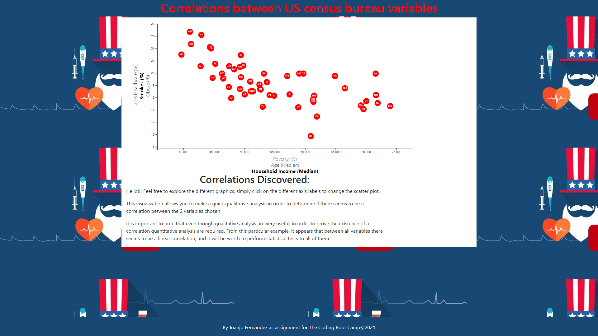

# d3-challenge

# Project Overview

This project consists in creating a d3 visualization from U.S. census data, aggregated by state, that will allow the user to determine visually if a correlation exists between 2 variables

# Project breakdown

- The project is divided in 2 parts, part 1 requires a static graphic that will correlate 2 variables of my choosing
- Part 2 requires to allow the user to choose 2 variables and display the corresponding graph, this has to be achieved dynamically
- For this project I will implement the solution thinking ahead for part 2, this requires to write functions for pretty much every parameter that the graph needs, making the resulting app much more scalable

# Repository structure
````bash
│   commits.md
│   index.html
│   LICENSE
│   README.md
│
└───assets
    ├───css
    │       d3Style.css
    │       style.css
    │
    ├───data
    │       data.csv
    │
    ├───images
    │       header.jpg
    │       US-Healthcare.jpg
    │
    └───js
            .eslintrc.json
            app.js
````

# Screenshots




